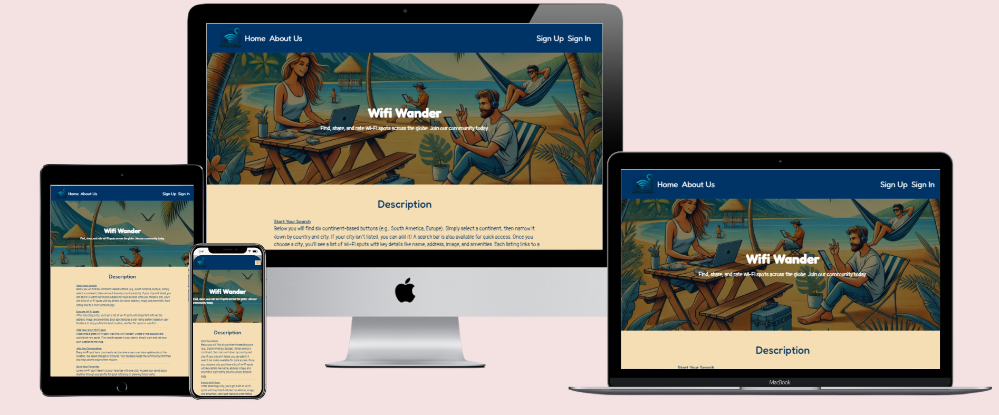

# Wifi Wander

## About the Project

- I created WifiWander as a platform specifically for digital nomads and remote workers who rely on finding reliable wifi while on the go. The website allows users to search for wifi spots in cities and regions worldwide, helping them locate places where they can work with uninterrupted internet access.

- The project uses React for the front-end and Django REST Framework for the back-end. The core feature of the site is a search tool that allows users to filter through continents, countries, and cities to discover all available wifi Locations. Additionally, logged-in users can contribute by adding new locations, posting reviews, and rating the quality of the wifi they’ve experienced.

- With WifiWander, I aimed to make it simple for users to:
  • Search for wifi Locations by region, country, or city through a clean, intuitive interface.
  • Filter results based on amenities, such as charging stations or quiet spaces, to find a location that meets their needs.
  • Contribute by adding wifi spots, leaving reviews, and managing their favorite locations through their personal profiles.

- I applied agile development practices, organizing the project into sprints and using user stories to guide the implementation of key features. The project is fully responsive, ensuring users can access it from any device, while maintaining strong UX and accessibility principles.

- Overall, WifiWander is designed to build a community-driven platform for remote workers, where they can discover new wifi spots, share comments, and contribute their own findings from around the world. The aim is to make finding reliable workspaces as straightforward as possible for digital nomads.

[Live Website Link](https://wifi-wander-74985bea95e7.herokuapp.com/)

## Target Audience

**What was the idea behind building the product?**

- Provide a centralized platform where users can search for Wi-Fi locations globally.
- Offer detailed information about each Wi-Fi location to users.
- Enable users to filter Wi-Fi locations based on city and specific criteria.
- Build a comprehensive repository of Wi-Fi locations.
- Allow users to filter and find the best Wi-Fi location based on ratings and amenities.
- Enable users to rate Wi-Fi locations and provide feedback.
- Show available amenities at each Wi-Fi location.

**Who is the user?**

- The platform is accessible to users of any age group.
- The primary audience includes digital nomads who travel frequently and rely on Wi-Fi.
- Users will be searching for Wi-Fi spots for business or leisure purposes.
- They will seek detailed information about the Wi-Fi location, including amenities offered.
- Users will want a way to gauge the quality of Wi-Fi at each location.

**What are the needs/wants of the users?**

- Users should easily navigate the platform and locate relevant information.
- They should be able to filter results to narrow down their search for specific Wi-Fi locations.
- The platform should be visually appealing, encouraging users to return.
- Users should have the ability to add new Wi-Fi locations they discover.
- Account creation should be available for enhanced interaction, such as commenting or rating.
- Users should be able to comment, rate, and review Wi-Fi locations.
- They should also find information about available amenities at each location.

**What are the needs/wants of the business?**

- Establish a go-to website for digital nomads seeking reliable Wi-Fi.
- Encourage regular user engagement and updates of new Wi-Fi locations.
- Ensure the platform is easy to navigate for all users.
- Create a visually appealing and well-balanced mix of images and text.
- Make adding a new Wi-Fi location simple and intuitive.
- Build and maintain a reliable repository of Wi-Fi locations worldwide.

**How does the site meet the needs of the user and business?**

- The homepage clearly states the platform's purpose, helping users understand its value.
- The search system is easy to use, allowing users to find Wi-Fi spots in any city.
- If no results are found, users are prompted to create a new listing, contributing to the repository.
- The platform serves as a centralized resource for global Wi-Fi locations.
- Users are encouraged to interact through the rating system and comment features.
- Creating an account enables users to add listings and contribute more actively.
- The platform ensures up-to-date information through user contributions.
