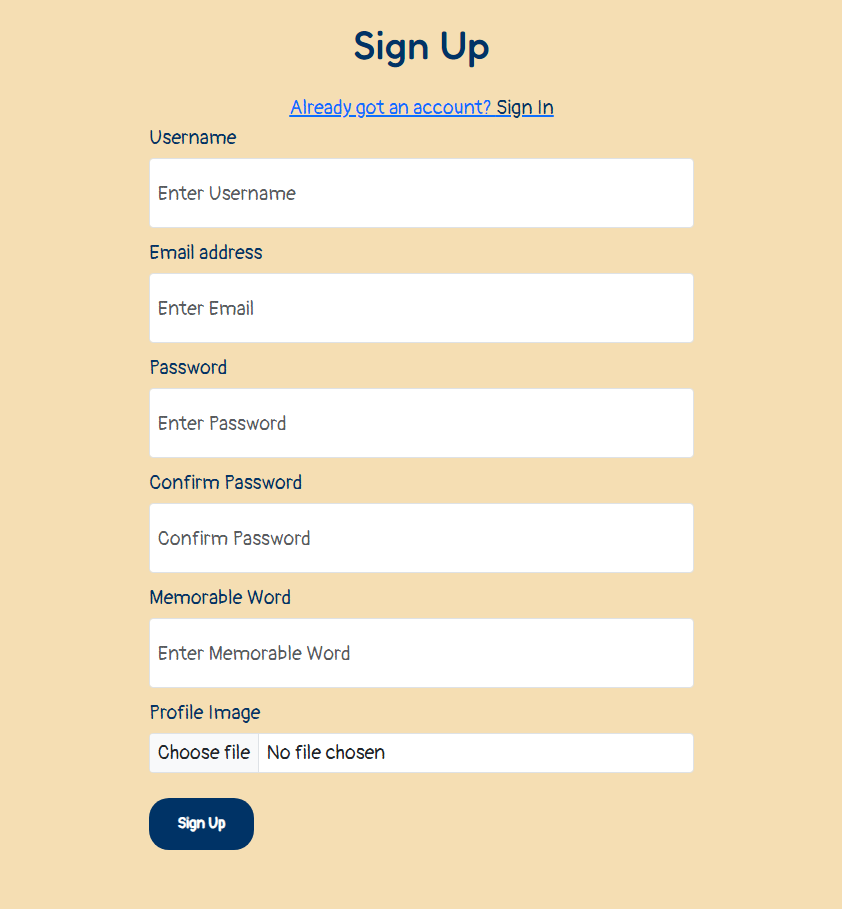
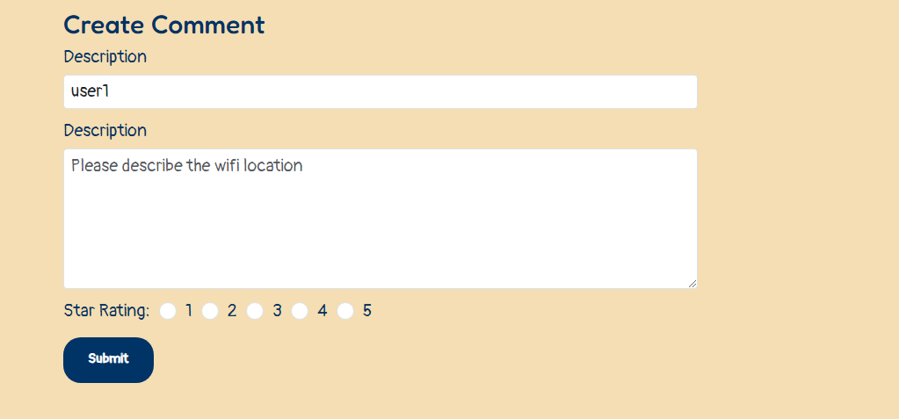

# Wifi Wander

## About the Project

- I created WifiWander as a platform specifically for digital nomads and remote workers who rely on finding reliable wifi while on the go. The website allows users to search for wifi spots in cities and regions worldwide, helping them locate places where they can work with uninterrupted internet access.

- The project uses React for the front-end and Django REST Framework for the back-end. The core feature of the site is a search tool that allows users to filter through continents, countries, and cities to discover all available wifi Locations. Additionally, logged-in users can contribute by adding new locations, posting reviews, and rating the quality of the wifi they’ve experienced.

- With WifiWander, I aimed to make it simple for users to:
  • Search for wifi Locations by region, country, or city through a clean, intuitive interface.
  • Filter results based on amenities, such as charging stations or quiet spaces, to find a location that meets their needs.
  • Contribute by adding wifi spots, leaving reviews, and managing their favorite locations through their personal profiles.

- I applied agile development practices, organizing the project into sprints and using user stories to guide the implementation of key features. The project is fully responsive, ensuring users can access it from any device, while maintaining strong UX and accessibility principles.

- Overall, WifiWander is designed to build a community-driven platform for remote workers, where they can discover new wifi spots, share comments, and contribute their own findings from around the world. The aim is to make finding reliable workspaces as straightforward as possible for digital nomads.

[Live Website Link](https://wifi-wander-74985bea95e7.herokuapp.com/)

## Target Audience

**What was the idea behind building the product?**

- Provide a centralized platform where users can search for Wi-Fi locations globally.
- Offer detailed information about each Wi-Fi location to users.
- Enable users to filter Wi-Fi locations based on city and specific criteria.
- Build a comprehensive repository of Wi-Fi locations.
- Allow users to filter and find the best Wi-Fi location based on ratings and amenities.
- Enable users to rate Wi-Fi locations and provide feedback.
- Show available amenities at each Wi-Fi location.

**Who is the user?**

- The platform is accessible to users of any age group.
- The primary audience includes digital nomads who travel frequently and rely on Wi-Fi.
- Users will be searching for Wi-Fi spots for business or leisure purposes.
- They will seek detailed information about the Wi-Fi location, including amenities offered.
- Users will want a way to gauge the quality of Wi-Fi at each location.

**What are the needs/wants of the users?**

- Users should easily navigate the platform and locate relevant information.
- They should be able to filter results to narrow down their search for specific Wi-Fi locations.
- The platform should be visually appealing, encouraging users to return.
- Users should have the ability to add new Wi-Fi locations they discover.
- Account creation should be available for enhanced interaction, such as commenting or rating.
- Users should be able to comment, rate, and review Wi-Fi locations.
- They should also find information about available amenities at each location.

**What are the needs/wants of the business?**

- Establish a go-to website for digital nomads seeking reliable Wi-Fi.
- Encourage regular user engagement and updates of new Wi-Fi locations.
- Ensure the platform is easy to navigate for all users.
- Create a visually appealing and well-balanced mix of images and text.
- Make adding a new Wi-Fi location simple and intuitive.
- Build and maintain a reliable repository of Wi-Fi locations worldwide.

**How does the site meet the needs of the user and business?**

- The homepage clearly states the platform's purpose, helping users understand its value.
- The search system is easy to use, allowing users to find Wi-Fi spots in any city.
- If no results are found, users are prompted to create a new listing, contributing to the repository.
- The platform serves as a centralized resource for global Wi-Fi locations.
- Users are encouraged to interact through the rating system and comment features.
- Creating an account enables users to add listings and contribute more actively.
- The platform ensures up-to-date information through user contributions.

## Scope

### What will the site include?

- **Search and Navigation**

  - The website will allow users to search for Wi-Fi spots by filtering through continents, countries, and cities. The homepage will feature interactive images representing each continent, making navigation simple and intuitive.
  - Logged-in users will have the ability to add new Wi-Fi locations if their search does not return a Wi-Fi location they were looking for.

- **User Contributions**

  - By creating an account, users can contribute to the platform by adding new Wi-Fi locations. They can also review existing locations and rate the Wi-Fi strength using a star-rating system.
  - Users can leave comments on each Wi-Fi location to provide up-to-date information or report any changes.

- **User Profiles**

  - Each user will have a personalized profile page where they can manage their contributions, including the Wi-Fi locations they’ve added. Users can also save Wi-Fi locations to a list of favourites for future reference.

- **Wi-Fi Page**

  - Each Wi-Fi location page will include a description, star rating, an image of the location, icons representing available amenities, and comments from other users.

- **Comments Section**

  - Logged-in users will have the ability to leave a comment under a Wi-Fi location, along with a rating based on their experience with the Wi-Fi and the location.

- **Description**

  - A section on the homepage will provide a clear description of how to use the site and what users can expect.

- **About Page**
  - This section will introduce the team behind the site, featuring images and a description of how the company started, along with the inspiration behind the idea.

## Structure

### Site Map

- Below shows a breakdown of the website depending on the logged in status of the user

**Logged in user or Admin**

- This wil be a user who has an account or admin

**General user**

- This will be a user with no log in details i.e general user

## Data Schema

- User Profile

  - The User Profile model stores all the necessary information for each registered user. It manages login credentials, user details, and profile images. Each user can add wifi locations, post comments, and save their favorite spots.

- Wifi Location

  - The Wifi Location model holds all the details about each wifi location added to the platform. Each wifi spot includes the location’s name, address, and available amenities. The model is connected to the user who added the location and supports features such as user ratings and comments.

- Comments

  - The Comments model allows users to leave feedback on individual wifi locations. Each comment is linked to both the user who posted it and the relevant wifi location. Users can rate the wifi quality with a star rating, and the comments section provides additional insights on the spot.

- Favorites
  - The Favorites model enables users to save wifi locations for future reference. Users can organize their favorite spots, add notes, and mark whether they’ve visited a location. Each favorite is tied to both the user’s profile and the wifi location.

## Skeleton

### Wireframe

- I created wireframes for each page of the website, showing how the site will appear both in mobile and browser format.

**Homepage**

**Country and city**

- These two pages have been combined as the basic layout is the same the only difference is the content

**Wifi location list**

**About Page**

**Wifi location page**

**Profile – Created and Favioutes**

- These two pages have been combined as the basic layout is the same the only difference is the content, they will not both appear at the same time

**Comments - C.R.U.D**

- The image below shows the comments and also the update and delete functions
- If a user creates a comment they wil see the update and delete next to it
- Including how to create a comment

**Sign in and Sign Up**

**Sign out**

**Pop Up Message**

**Create/edit wifi location**

**Delete comment/wifi location**

## Surface

**Images**

- For the logo this was generated from input text from myself where I described the website.
- The images that were used on the about page came from a site called unsplash
- The images on the homepage showing the 6 continents came from Wikipedia

**Colour Scheme**

- The website was created using colours that are in keeping with travel, journey, working on the go. All colours were checked to make sure they did not clash and had the correct contrast with one another.

- Header and Footer:

  - Background: Deep Blue (#003366)
  - Text: White (#FFFFFF)
  - Hover Links: neon green (#00f733)

- Website Body Content:

  - Background: Sand Beige (#F5DEB3)
  - All Text: Deep Blue (#003366)
  - Button background: Deep Blue (#003366)
  - Button Text: White (#FFFFFF)
  - Button background hover: neon green (#00f733)
  - Hover Button Text: White (#003366)

- Wifi location list

  - Background: Deep Blue (#003366)
  - Text: White (#FFFFFF)

- Listings / Featured Regions:

  - Background: Deep Blue (#003366)
  - Text: White (#FFFFFF)
  - Star Ratings: neon green (#00f733)
  - Hover Links: neon green (#00f733)

- Breadcrumb
  - Text: Deep Blue (#003366)
  - Text Hover: maroon (#800000)

**Typography**

- The theme for this website was Digital Noamds and how they operate whereby they are always travelling around the world therefore the font styles I selected were done so as they complemented that theme.

- Fonts were taken from google fonts:

  - Header font: fredoka - [Link](https://fonts.google.com/specimen/Fredoka?colors=140f11-fcfbfc-987987-b1bfab-97afa1&fonts=Pangolin-Inter&query=Fredoka)

  

  - Main text font: Pangolin - [Link](https://fonts.google.com/specimen/Pangolin?colors=140f11-fcfbfc-987987-b1bfab-97afa1&fonts=Pangolin-Inter&query=Pangolin)

  

## Agile

Kanban Board Link - [Link](https://github.com/users/GMontaque/projects/7)

- Due to time constraints and work load not all user stories which were created were completed and some were not included all together or their priority had to be changed to make sure an MVP product was produced

**Epics**

- During the design stage of my project, I decided on the different features, structure and strategy for the site, this was broken down for the project using the agile methodology to better understand how to complete the project and implement the necessary features. At the same time, this ensured that the most important features were implemented first and that a deliverable product (minimum viable product) was created, even if some of the features were not completed within the set time. 12 EPICS were created 11 for the front end and 1 for the back end. These were then further broken down 12 user stories for the back end and 73 user stories for the front end.

- Below is the list of the 11 EPICS which were created for front end section of this project.

  - EPIC 1: Project set up
  - EPIC 2: Website Navigation
  - EPIC 3: Wifi Spot Filtering and Display
  - EPIC 4: User Authentication and Authorisation
  - EPIC 5: WIFI location page Creation and CRUD
  - EPIC 6: Wifi Location Page
  - EPIC 7: City and Country Profiles
  - EPIC 8: Error Handling
  - EPIC 9: Testing
  - EPIC 10: Wifi Location Page Features
  - EPIC 11: “Possibles” visit WIFI Locations

- Below is the list of the EPIC which were created for Back End section of this project.
  - EPIC 1: Back-End API Development

**User stories**

- Once the user stories and epics had been created, the next stage was to break them down to understand which to prioritize and which could be left to be completed at a later stage. I used the MoSCoW prioritization technique to do this. This process works by giving each user story a score (story point) as to the estimated amount of effort required to implement the user story and then once implemented checked against the acceptance criteria. The story point number system uses something called the Fibonacci numbers, the reason for this is that the number sequence goes (1, 2, 3, 5, 8, 13, etc.), the benefit of which is that it allows for the different size of tasks. For example setting up a GitHub repository is a relatively easy task but styling a website is much more complex with a number of parts, which the Fibonacci numbers allows for.

- Each entry in the kanban board shows the MoSCoW prioritisation result.

- MoSCoW prioritization technique stands for:

  - Must-Have: Critical requirements that must be implemented for the project to be considered successful.
  - Should-Have: Important requirements that are not critical but add significant value.
  - Could-Haves: Desirable features that would be nice to have but are not crucial.
  - Won't-Have: Features that are explicitly excluded from the project scope.

- The total Story Points in the project is 253.
- Must-Have : 189 story points
- Should-Have : 51 story points
- Could-Have : 13 story points
- Wont-Have

**Mock Kanban Board**

- As referenced previously, when deciding on how to proceed, I first broke the user stories down using the MoSCow technique and then added a story point value to each user story. I went through a few iterations to decide on the order of completion. Having arrived at a satisfactory order, I completed the project over 5 iterations.

[Excel Spreadsheet](https://docs.google.com/spreadsheets/d/1MN09sHqwkGb0rT8LuqexFH33Z2vpBfb0pXv4thdSXCI/edit?usp=sharing)

## Features

### Navigation Bar

- The navigation bar appears at the top of all pages within the website.
- Before a user logs in, the navigation bar contains links to the logo, home, about, sign-up, and sign-in pages.
- For a logged-in user, the navigation bar updates to include home, about, add location, profile, and log-out links.
- Non-logged-in users will only see the standard navigation bar links.
- When a link is moused over, its color changes to indicate focus. Additionally, the link to the current page the user is on will appear in a different color on the navigation bar.

- **Navigation Bar - General User**

- **Navigation Bar - Admin and Logged-in User**

- **Mobile Navigation Bar**

### Footer

- The footer appears at the bottom of all the web pages.
- It contains social media links, website links, and a logo.
- There is also a section containing legal wording.

- **Footer Mobile**

### Home Page

- The page contains the navigation bar, a hero image with the website title, and a small caption. The hero image is auto-generated.
- **Description section**: This explains the website in more detail.
- **Continent images**: These are used to allow the user to search the website for different Wi-Fi locations.
- The footer contains website links and social media links.

  
  

- **Homepage Mobile**

### Filtering by Location (Continent/Country/City)

- A user can click on any of the 6 continent images.
- Upon clicking a link, the user is taken to a page showing countries for further filtering.
- After selecting a country, they will be directed to a list of cities.
- Finally, after selecting a city, the user will see a list of Wi-Fi locations in that city.
- If no result is found for a continent, the user can click on a button to add a new location (they must be signed in to do so).

- **Continent Full Screen and Mobile**

  

- **Country Full Screen and Mobile**

  

- **City Full Screen and Mobile**

  

### User Registration

- There is a link in the navigation bar that directs users to the registration form.
- Users must complete the form with a username, email, password, memorable name, and optionally a profile image.
- After submitting the form, a confirmation message appears, and the user is redirected to the homepage.
- A confirmation message will appear to confirm their registration.

- **Register Mobile**

### User Log In

- There is a link in the navigation bar that directs users to the log-in form.
- Users must enter their username and password.
- Once logged in, they are redirected to the homepage, and a confirmation message appears.
- The navigation bar updates with appropriate links based on the user's status.

- **Sign In Mobile**

### User Log Out

- The log-out link appears in the navigation bar once the user is logged in.
- Clicking this link opens a pop-up asking for confirmation.
- After confirming, the user is logged out, and a message appears confirming the action.

### Create Wi-Fi Location

- When a user is logged in, they will see an "add location" link in the navigation bar.
- Clicking the link takes the user to a form where they can input details such as the Wi-Fi location’s name, address, amenities, and an optional image.
- The city field is linked to a database that auto-fills the country and city upon selection.
- After submitting the form, a confirmation message will appear if successful.

- **Mobile**

### Wi-Fi Location Page

- After a user searches the website and clicks on a Wi-Fi location, they will be taken to this page.
- The page contains the full details of the Wi-Fi location, including:
  - Left side: An image of the location and its amenities.
  - Right side: The name, description, and comments section.
- Logged-in users can also add a comment.

- **Mobile**

### Delete Wi-Fi Location

- For the user who created the Wi-Fi location or an admin, two buttons appear at the top of the Wi-Fi location page, one of which is a delete button.
- Clicking the delete button opens a pop-up asking for confirmation.
- Once confirmed, the user will see a pop-up message confirming the deletion.

- **Mobile**

### Edit Wi-Fi Location

- The second button available to the user who created the Wi-Fi location or admin is the edit button.
- Clicking the button redirects the user to the Wi-Fi location creation form, pre-populated with the current data.
- Once the form is updated, a confirmation pop-up will appear.

- **Mobile**

### Create Comment

- Logged-in users can create a comment on any Wi-Fi location.
- The comment section is displayed below the Wi-Fi location information.
- The username is pre-filled, and users can add a comment and a star rating.
- After submitting the comment, a confirmation message will appear, and the comment will be displayed on the Wi-Fi page.

- **Mobile**

### View Comment

- All comments related to a Wi-Fi location are displayed below the description section.
- Each comment shows the username, star rating, and the comment content.
- Every Wi-Fi location has its own unique list of comments.

- **Mobile**

### Edit Comment

- Logged-in users who have created a comment will see two buttons next to their comments: edit and delete.
- Clicking the edit button pre-fills the comment section with the existing data, allowing the user to update it.
- After editing, a confirmation message will appear.

- **Mobile**

### Delete Comment

- Like the edit button, the delete button appears next to comments created by the logged-in user.
- Clicking the delete button opens a pop-up asking for confirmation.
- After confirming, the comment is deleted, and a pop-up message confirms its removal.

- **Mobile**

### Profile Page

- Users who have created an account and logged in will have a profile page.
- The profile page shows the user’s profile image, username, and a list of Wi-Fi locations they have created and favorited.
- The created and favorited Wi-Fi locations are split into two tabs, with summary information such as image, name, address, and links.

### Add Wi-Fi Location to Favorites

- To add a Wi-Fi location to a user's favorites list, they need to click the button that appears on that specific Wi-Fi location page.
- After clicking the button, a pop-up will confirm that the Wi-Fi location has been added to the favorites list.
- If the user has created the Wi-Fi location, they will not be able to add the location to their favorites.

- **Mobile**

### Remove Wi-Fi Location from Favorites

- To remove a Wi-Fi location from a user's favorites list, they need to go to their profile page and click on the favorites tab.
- Here, each Wi-Fi location will have a remove button next to it.
- When the user clicks the button, a pop-up will appear asking for confirmation to remove the location.
- If they confirm, the Wi-Fi location is removed from the favorites list, and a pop-up will confirm the action.

- **Mobile**

### About Page

- The About page can be accessed from the navigation bar.
- When clicked, it takes the user to a page divided into sections:
  - The top section provides an overview of the company.
  - Below, there is a section filled with images of company employees and descriptions about the company and the team.

- **Mobile**

## Future Implementations

- **Search Bar** – A search bar will be added to the homepage, allowing users to search for Wi-Fi locations by city or country without needing to use the image icons.
- **Reply to Comments** – On Wi-Fi location pages, users can currently create comments. A future feature would allow users to reply to comments and have conversations with others.
- **Suggestions** – A feature to recommend Wi-Fi locations based on the user’s current location, making it easier to find nearby spots.
- **Sorting Feature** – When a user filters a list of Wi-Fi locations down to a city, they will be able to sort by amenities, star rating, or proximity to the city center.
- **Gallery** – This feature will allow users to upload multiple images to Wi-Fi location pages, creating a gallery that others can view and scroll through.

## Testing

- Please see External testing file for manaul testing result, automated testing and errors/bugs

[Link to test.md](testing.md)

## Technologies and Languages

- HTML: A markup language used to create the structure and content of web pages.
- CSS: A styling language used to control the layout and visual appearance of web pages.
- JavaScript: A programming language used to add interactivity and dynamic effects to web pages.
- Python: A high-level programming language used for web development, data analysis, and artificial intelligence.
- Django: A high-level Python web framework that enables rapid development of secure and maintainable websites.
- Github: A web-based platform for version control and collaboration on software development projects.
- Bootstrap: A popular front-end framework used to build responsive and mobile-first web applications.
- Heroku: A cloud platform as a service (PaaS) that enables developers to build, deploy, and scale web applications.
- Vscode: A lightweight, open-source code editor developed by Microsoft that supports a wide range of programming languages.
- Gitpod: A cloud-based development environment that provides a pre-configured and collaborative coding experience.
- SweetAlert: A JavaScript library used to create customizable and responsive alert messages and modal windows for web applications.

## Requirments.txt

- Following requirements for the REST API

- asgiref==3.8.1
- cloudinary==1.41.0
- dj-database-url==2.2.0
- dj-rest-auth==2.1.9
- Django==4.2
- django-allauth==0.54.0
- django-cloudinary-storage==0.3.0
- django-cors-headers==4.4.0
- djangorestframework==3.15.2
- djangorestframework-simplejwt==5.3.1
- gunicorn==23.0.0
- oauthlib==3.2.2
- pillow==10.4.0
- psycopg2==2.9.9
- PyJWT==2.9.0
- python3-openid==3.2.0
- requests-oauthlib==2.0.0
- sqlparse==0.5.1
