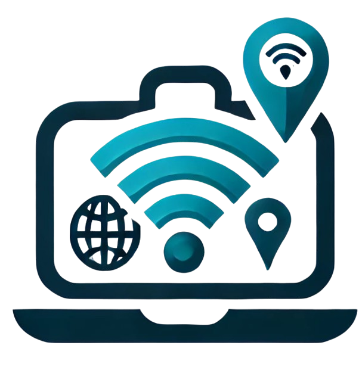

# Wifi Wander

## About the Project

- I created WifiWander as a platform specifically for digital nomads and remote workers who rely on finding reliable wifi while on the go. The website allows users to search for wifi spots in cities and regions worldwide, helping them locate places where they can work with uninterrupted internet access.

- The project uses React for the front-end and Django REST Framework for the back-end. The core feature of the site is a search tool that allows users to filter through continents, countries, and cities to discover all available wifi Locations. Additionally, logged-in users can contribute by adding new locations, posting reviews, and rating the quality of the wifi they’ve experienced.

- With WifiWander, I aimed to make it simple for users to:
  • Search for wifi Locations by region, country, or city through a clean, intuitive interface.
  • Filter results based on amenities, such as charging stations or quiet spaces, to find a location that meets their needs.
  • Contribute by adding wifi spots, leaving reviews, and managing their favorite locations through their personal profiles.

- I applied agile development practices, organizing the project into sprints and using user stories to guide the implementation of key features. The project is fully responsive, ensuring users can access it from any device, while maintaining strong UX and accessibility principles.

- Overall, WifiWander is designed to build a community-driven platform for remote workers, where they can discover new wifi spots, share comments, and contribute their own findings from around the world. The aim is to make finding reliable workspaces as straightforward as possible for digital nomads.

[Live Website Link](https://wifi-wander-74985bea95e7.herokuapp.com/)

## Target Audience

**What was the idea behind building the product?**

- Provide a centralized platform where users can search for Wi-Fi locations globally.
- Offer detailed information about each Wi-Fi location to users.
- Enable users to filter Wi-Fi locations based on city and specific criteria.
- Build a comprehensive repository of Wi-Fi locations.
- Allow users to filter and find the best Wi-Fi location based on ratings and amenities.
- Enable users to rate Wi-Fi locations and provide feedback.
- Show available amenities at each Wi-Fi location.

**Who is the user?**

- The platform is accessible to users of any age group.
- The primary audience includes digital nomads who travel frequently and rely on Wi-Fi.
- Users will be searching for Wi-Fi spots for business or leisure purposes.
- They will seek detailed information about the Wi-Fi location, including amenities offered.
- Users will want a way to gauge the quality of Wi-Fi at each location.

**What are the needs/wants of the users?**

- Users should easily navigate the platform and locate relevant information.
- They should be able to filter results to narrow down their search for specific Wi-Fi locations.
- The platform should be visually appealing, encouraging users to return.
- Users should have the ability to add new Wi-Fi locations they discover.
- Account creation should be available for enhanced interaction, such as commenting or rating.
- Users should be able to comment, rate, and review Wi-Fi locations.
- They should also find information about available amenities at each location.

**What are the needs/wants of the business?**

- Establish a go-to website for digital nomads seeking reliable Wi-Fi.
- Encourage regular user engagement and updates of new Wi-Fi locations.
- Ensure the platform is easy to navigate for all users.
- Create a visually appealing and well-balanced mix of images and text.
- Make adding a new Wi-Fi location simple and intuitive.
- Build and maintain a reliable repository of Wi-Fi locations worldwide.

**How does the site meet the needs of the user and business?**

- The homepage clearly states the platform's purpose, helping users understand its value.
- The search system is easy to use, allowing users to find Wi-Fi spots in any city.
- If no results are found, users are prompted to create a new listing, contributing to the repository.
- The platform serves as a centralized resource for global Wi-Fi locations.
- Users are encouraged to interact through the rating system and comment features.
- Creating an account enables users to add listings and contribute more actively.
- The platform ensures up-to-date information through user contributions.

## Scope

### What will the site include?

- **Search and Navigation**

  - The website will allow users to search for Wi-Fi spots by filtering through continents, countries, and cities. The homepage will feature interactive images representing each continent, making navigation simple and intuitive.
  - Logged-in users will have the ability to add new Wi-Fi locations if their search does not return a Wi-Fi location they were looking for.

- **User Contributions**

  - By creating an account, users can contribute to the platform by adding new Wi-Fi locations. They can also review existing locations and rate the Wi-Fi strength using a star-rating system.
  - Users can leave comments on each Wi-Fi location to provide up-to-date information or report any changes.

- **User Profiles**

  - Each user will have a personalized profile page where they can manage their contributions, including the Wi-Fi locations they’ve added. Users can also save Wi-Fi locations to a list of favourites for future reference.

- **Wi-Fi Page**

  - Each Wi-Fi location page will include a description, star rating, an image of the location, icons representing available amenities, and comments from other users.

- **Comments Section**

  - Logged-in users will have the ability to leave a comment under a Wi-Fi location, along with a rating based on their experience with the Wi-Fi and the location.

- **Description**

  - A section on the homepage will provide a clear description of how to use the site and what users can expect.

- **About Page**
  - This section will introduce the team behind the site, featuring images and a description of how the company started, along with the inspiration behind the idea.

## Structure

### Site Map

- Below shows a breakdown of the website depending on the logged in status of the user

**Logged in user or Admin**

- This wil be a user who has an account or admin

**General user**

- This will be a user with no log in details i.e general user

## Data Schema

- User Profile

  - The User Profile model stores all the necessary information for each registered user. It manages login credentials, user details, and profile images. Each user can add wifi locations, post comments, and save their favorite spots.

- Wifi Location

  - The Wifi Location model holds all the details about each wifi location added to the platform. Each wifi spot includes the location’s name, address, and available amenities. The model is connected to the user who added the location and supports features such as user ratings and comments.

- Comments

  - The Comments model allows users to leave feedback on individual wifi locations. Each comment is linked to both the user who posted it and the relevant wifi location. Users can rate the wifi quality with a star rating, and the comments section provides additional insights on the spot.

- Favorites
  - The Favorites model enables users to save wifi locations for future reference. Users can organize their favorite spots, add notes, and mark whether they’ve visited a location. Each favorite is tied to both the user’s profile and the wifi location.

## Skeleton

### Wireframe

- I created wireframes for each page of the website, showing how the site will appear both in mobile and browser format.

**Homepage**

**Country and city**

- These two pages have been combined as the basic layout is the same the only difference is the content

**Wifi location list**

**About Page**

**Wifi location page**

**Profile – Created and Favioutes**

- These two pages have been combined as the basic layout is the same the only difference is the content, they will not both appear at the same time

**Comments - C.R.U.D**

- The image below shows the comments and also the update and delete functions
- If a user creates a comment they wil see the update and delete next to it
- Including how to create a comment

**Sign in and Sign Up**

**Sign out**

**Pop Up Message**

**Create/edit wifi location**

**Delete comment/wifi location**

## Surface

**Images**

- For the logo this was generated from input text from myself where I described the website.
- The images that were used on the about page came from a site called unsplash
- The images on the homepage showing the 6 continents came from Wikipedia

**Colour Scheme**

- The website was created using colours that are in keeping with travel, journey, working on the go. All colours were checked to make sure they did not clash and had the correct contrast with one another.

- Header and Footer:

  - Background: Deep Blue (#003366)
  - Text: White (#FFFFFF)
  - Hover Links: neon green (#00f733)

- Website Body Content:

  - Background: Sand Beige (#F5DEB3)
  - All Text: Deep Blue (#003366)
  - Button background: Deep Blue (#003366)
  - Button Text: White (#FFFFFF)
  - Button background hover: neon green (#00f733)
  - Hover Button Text: White (#003366)

- Wifi location list

  - Background: Deep Blue (#003366)
  - Text: White (#FFFFFF)

- Listings / Featured Regions:

  - Background: Deep Blue (#003366)
  - Text: White (#FFFFFF)
  - Star Ratings: neon green (#00f733)
  - Hover Links: neon green (#00f733)

- Breadcrumb
  - Text: Deep Blue (#003366)
  - Text Hover: maroon (#800000)

**Typography**

- The theme for this website was Digital Noamds and how they operate whereby they are always travelling around the world therefore the font styles I selected were done so as they complemented that theme.

- Fonts were taken from google fonts:

  - Header font: fredoka - [Link](https://fonts.google.com/specimen/Fredoka?colors=140f11-fcfbfc-987987-b1bfab-97afa1&fonts=Pangolin-Inter&query=Fredoka)

  

  - Main text font: Pangolin - [Link](https://fonts.google.com/specimen/Pangolin?colors=140f11-fcfbfc-987987-b1bfab-97afa1&fonts=Pangolin-Inter&query=Pangolin)

  
