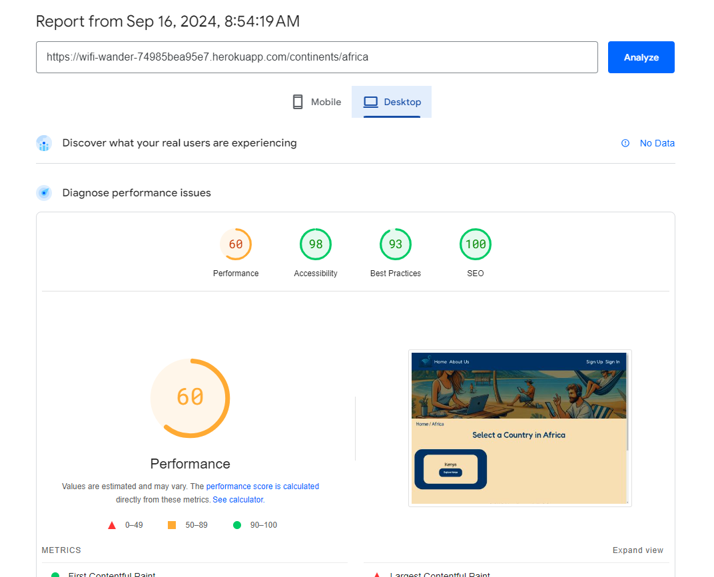

## Testing

### Manual Testing

| Feature being tested                                                                                          | Test carried out                                                                      | Expected outcome                                                                                                                                                                                                                    | Pass |
| ------------------------------------------------------------------------------------------------------------- | ------------------------------------------------------------------------------------- | ----------------------------------------------------------------------------------------------------------------------------------------------------------------------------------------------------------------------------------- | ---- |
| Webpage loads showing homepage                                                                                | Enter URL address of website                                                          | Homepage component loads with correct content                                                                                                                                                                                       | Pass |
| Navbar hover effect                                                                                           | Mouse over navbar links and then move mouse away                                      | All navigation bar links should change color when moused over to show focus and then return to normal                                                                                                                               | Pass |
| Navbar links update depending on user access                                                                  | Logging in as admin or a user with an account                                         | Navbar links should update as per the wireframe with the links that only a user with an account should access, such as profile and add location.                                                                                    | Pass |
| Login button                                                                                                  | Clicking log in button                                                                | When clicking the log in button, the user is taken to the log in page                                                                                                                                                               | Pass |
| User enters details and logs in                                                                               | Enter details of a user account already created and details of a user with no account | When the details of the logged-in user account are entered, the user is signed in. When the details of a non-account user are entered, the user is shown an error message                                                           | Pass |
| Log in and out pop up message                                                                                 | Log a user in and out of the website                                                  | Pop-up message appears showing the user is either logged in or logged out                                                                                                                                                           | Pass |
| Sign Up button                                                                                                | Clicking Sign Up button                                                               | When clicking the register button, the user is taken to the registration page                                                                                                                                                       | Pass |
| User enters details, creates an account, and is logged in                                                     | Fill in part of the sign-up form and attempt to submit, then fill in the full form    | When a user completes only part of the form, the user is shown an error. When the user completes the form in full, an account is created, and the user is redirected to the sign-in page.                                           | Pass |
| Registration pop-up message                                                                                   | Register a new user                                                                   | Pop-up message appears showing the user is logged in and an account has been registered                                                                                                                                             | Pass |
| Clicking continent image takes user to correct country page                                                   | Click on several different continent images                                           | When clicking on the continent image, it should only show countries that can be found in that continent and have results                                                                                                            | Pass |
| Clicking country link takes user to correct city page                                                         | Click on several different country links                                              | When clicking on the country link, it should only show cities that can be found in that country and have results                                                                                                                    | Pass |
| Clicking cities image takes user to a list of Wi-Fi locations                                                 | Click on several different city links                                                 | When clicking on the city link, it should take the user to a table list of all Wi-Fi locations in that city                                                                                                                         | Pass |
| Clicking Wi-Fi location link in table list takes user to full page                                            | Click on several different Wi-Fi location links                                       | When clicking on the link, it should take the user to the correct Wi-Fi location page                                                                                                                                               | Pass |
| Wi-Fi location page loads with correct content                                                                | Load several Wi-Fi location pages                                                     | When the Wi-Fi location page loads, there is the correct title, image, amenities, description, and comments on the page                                                                                                             | Pass |
| Clicking Add new location button takes you to Wi-Fi create form                                               | Log in as a user or admin and click on add location in navbar                         | When clicking the link, the user is taken to the add location page, and the full form appears                                                                                                                                       | Pass |
| When user hits the submit button on the Wi-Fi location creation form when the form is empty, an error appears | Try to submit form with no data                                                       | Navigate to the Wi-Fi creation form and try to press the submit button a number of times. An error message should appear                                                                                                            | Pass |
| Submit Wi-Fi location creation form with full information completed                                           | Add in all details that the form requires                                             | When all the required information is added, the form will submit, and a pop-up message appears confirming this                                                                                                                      | Pass |
| Duplicate name check on Wi-Fi location creation form                                                          | Create two Wi-Fi locations with the same name                                         | When the first Wi-Fi location is created, it is accepted, and a pop-up message appears confirming this. When the second Wi-Fi location is attempted to be created with the same name, an error appears and stops the creation.      | Pass |
| User clicks on continent, country, or city doesn’t find a result and clicks add Wi-Fi location                | User both logged in and not logged in clicks the button                               | For a logged-in user, they are taken to the correct page and can see the form. For non-logged-in users, they are taken to the sign-in page                                                                                          | Pass |
| Footer external links                                                                                         | Clicking on different external links                                                  | When clicking on one of the 3 links, the user is taken to either Twitter, Facebook, or Instagram                                                                                                                                    | Pass |
| Footer internal links                                                                                         | Clicking on different internal links                                                  | When clicking on one of the Home or About page links, the user is taken to the correct page                                                                                                                                         | Pass |
| Footer logo link                                                                                              | Click on logo image link                                                              | If the user is not on the homepage, they are taken to the homepage                                                                                                                                                                  | Pass |
| Logged-in user can access profile page                                                                        | Log in as a user and click on the profile link in the navbar                          | When a user logs in and clicks the profile link, they are taken to their own profile page                                                                                                                                           | Pass |
| Logged-in user can view Wi-Fi locations they have created in the profile created list                         | Log in as a user and click on profile link in navbar                                  | When a user clicks on their profile, there should be two tabs that appear: the first should be a full list of all Wi-Fi locations they created                                                                                      | Pass |
| Logged-in user can view Wi-Fi locations they added to their favorites list                                    | Log in as a user and click on profile link in navbar and then the favorites tab       | When a user clicks on their profile, there should be two tabs that appear. They then click on the second tab, and the list of favorites appears                                                                                     | Pass |
| Clicking the link next to the Wi-Fi location in the created tab takes you to the full Wi-Fi location page     | Click on several Wi-Fi location links                                                 | When the links are clicked, they take the user to the correct Wi-Fi location full page                                                                                                                                              | Pass |
| Admin Edit Wi-Fi location page                                                                                | Attempt to update the content of a Wi-Fi location page                                | When the admin attempts to update the Wi-Fi location, this can be done on any Wi-Fi location, and they receive a confirmation pop-up when completed                                                                                 | Pass |
| User Edit Wi-Fi location page                                                                                 | Attempt to update the content of a Wi-Fi location                                     | A check is done to make sure the user is logged in and created the Wi-Fi location. If that passes, the user can update the Wi-Fi location, and when they submit the changes, they see the confirmation pop-up                       | Pass |
| Admin and user delete Wi-Fi location page                                                                     | Attempt to delete a Wi-Fi location page                                               | A check is done to confirm if the user is an admin or the user who created the Wi-Fi location. If the check passes, a pop-up will appear confirming the delete request. Once confirmed, a second confirmation appears once deleted. | Pass |
| Clicking the link next to the Wi-Fi location in the favorites tab takes you to the full Wi-Fi location page   | Click on several Wi-Fi locations links                                                | When the links are clicked, they take the user to the correct Wi-Fi location full page                                                                                                                                              | Pass |
| Clicking the delete button for a specific Wi-Fi location in the favorites list removes it from the list       | Click on the remove button next to Wi-Fi locations                                    | When the delete button is clicked, a pop-up appears asking them to confirm if they want to delete this Wi-Fi location. If they click “yes,” it is deleted and removed from the list                                                 | Pass |
| Clicking About page link takes you to the About page                                                          | Click on all links in the navigation bar                                              | When clicking on all the links in the navigation bar, only the one marked About Us should take the user to the About page                                                                                                           | Pass |
| Navbar logo image takes you to the homepage                                                                   | Navigate to another page and click on the logo image                                  | When the user clicks this button, they are taken back to the homepage                                                                                                                                                               | Pass |
| Logged-in user can create a comment                                                                           | Go to a Wi-Fi location page and fill in the comments section form                     | When the user fills in the form and all the fields, a pop-up appears confirming the comment has been submitted, and it appears on the Wi-Fi location page                                                                           | Pass |
| Logged-in user can edit comment                                                                               | Try to edit comment                                                                   | When a user visits a Wi-Fi location page, if they have created a comment, they will see an edit button. Clicking the edit button pre-populates the create comment section                                                           | Pass |
| Pop-up confirmation on edited comment                                                                         | User attempts to edit and submit a comment                                            | When a user has finished editing a comment and hits submit, if all fields are correct, it submits, and they get a confirmation pop-up                                                                                               | Pass |
| Logged-in user can delete comment                                                                             | User attempts to delete comment                                                       | If a user has created a comment, next to the edit button will be the delete button. When clicking the delete button, a pop-up                                                                                                       |

### Automated Testing

- As part of testing the site, I have implemented unit testing on different parts of the API. Below is a list of all the files that were tested along with their results.

- The automated testing that I carried out was conducted on the python code in the website.

**Wifi Location App**

```
from rest_framework.test import APITestCase, APIClient
from rest_framework import status
from django.urls import reverse
from django.contrib.auth.models import User
from wifi_locations.models import WifiLocation


class WifiLocationTests(APITestCase):
    def setUp(self):
        self.user = User.objects.create_user(
            username='testuser', password='testpass'
        )
        self.wifi_location = WifiLocation.objects.create(
            name="Test Wifi Location",
            street="123 Test St",
            city="Test City",
            country="Test Country",
            postcode="12345",
            description="Test description",
            amenities="Test amenities",
            continent="Europe",
            added_by=self.user
        )
        self.client = APIClient()

    def test_get_wifi_locations_list(self):
        """
        Test retrieving the list of WiFi locations
        """
        response = self.client.get(reverse('wifi_location_list'))
        self.assertEqual(response.status_code, status.HTTP_200_OK)
        self.assertIn('Test Wifi Location', response.data[0]['name'])

    def test_get_single_wifi_location(self):
        """
        Test retrieving a single WiFi location by ID
        """
        response = self.client.get(
            reverse(
                'wifi_location_detail',
                kwargs={'pk': self.wifi_location.pk}
            )
        )

        self.assertEqual(response.status_code, status.HTTP_200_OK)
        self.assertEqual(response.data['name'], self.wifi_location.name)

    def test_create_wifi_location(self):
        """
        Test creating a new WiFi location
        """
        self.client.login(username='testuser', password='testpass')
        data = {
            'name': 'New Wifi Location',
            'street': '456 New St',
            'city': 'New City',
            'country': 'New Country',
            'postcode': '67890',
            'description': 'New description',
            'amenities': 'New amenities',
            'continent': 'Asia',
        }
        response = self.client.post(
            reverse('wifi_location_list'), data, format='json'
        )
        self.assertEqual(response.status_code, status.HTTP_201_CREATED)
        self.assertEqual(WifiLocation.objects.count(), 2)
        self.assertEqual(response.data['name'], 'New Wifi Location')

    def test_update_wifi_location(self):
        """
        Test updating an existing WiFi location
        """
        self.client.login(username='testuser', password='testpass')
        data = {
            'name': 'Updated Wifi Location',
            'street': self.wifi_location.street,
            'city': self.wifi_location.city,
            'country': self.wifi_location.country,
            'postcode': self.wifi_location.postcode,
            'description': 'Updated description',
            'amenities': self.wifi_location.amenities,
            'continent': self.wifi_location.continent,
        }
        response = self.client.put(
            reverse(
                'wifi_location_detail',
                kwargs={'pk': self.wifi_location.pk}
            ),
            data=data,
            format='json'
        )

        self.assertEqual(response.status_code, status.HTTP_200_OK)
        self.wifi_location.refresh_from_db()
        self.assertEqual(self.wifi_location.name, 'Updated Wifi Location')

    def test_delete_wifi_location(self):
        """
        Test deleting a WiFi location
        """
        self.client.login(username='testuser', password='testpass')
        response = self.client.delete(
            reverse(
                'wifi_location_detail',
                kwargs={'pk': self.wifi_location.pk}
            )
        )

        self.assertEqual(response.status_code, status.HTTP_204_NO_CONTENT)
        self.assertEqual(WifiLocation.objects.count(), 0)

    def test_cannot_create_duplicate_wifi_location(self):
        """
        Test that creating two Wi-Fi locations with the same name is not
        allowed
        """
        self.client.login(username='testuser', password='testpass')

        data = {
            'name': 'Test Wifi Location',
            'street': '456 New St',
            'city': 'New City',
            'country': 'New Country',
            'postcode': '67890',
            'description': 'New description',
            'amenities': 'New amenities',
            'continent': 'Asia',
        }

        response = self.client.post(
            reverse('wifi_location_list'), data, format='json'
        )

        self.assertEqual(response.status_code, status.HTTP_400_BAD_REQUEST)
        self.assertIn('name', response.data)
        self.assertEqual(
            response.data['name'][0],
            'wifi location with this name already exists.'
        )


```

- Result
  - 

**Comments App**

```
from rest_framework.test import APITestCase, APIClient
from rest_framework import status
from django.urls import reverse
from django.contrib.auth.models import User
from wifi_locations.models import WifiLocation
from comments.models import Comments


class CommentTests(APITestCase):
    def setUp(self):
        self.user = User.objects.create_user(
            username='testuser', password='testpass')
        self.wifi_location = WifiLocation.objects.create(
            name="Test Wifi Location")
        self.comment = Comments.objects.create(
            user=self.user,
            wifi_location=self.wifi_location,
            comment_text="Test comment",
            star_rating=4
        )
        self.client = APIClient()

    def test_get_comments_list(self):
        """
        Test retrieving the list of comments
        """
        response = self.client.get(reverse('comments-list'))
        self.assertEqual(response.status_code, status.HTTP_200_OK)
        self.assertIn('Test comment', response.data[0]['comment_text'])

    def test_get_comments_list_for_wifi_location(self):
        """
        Test retrieving the list of comments filtered by wifi_location
        """
        response = self.client.get(
            reverse('comments-list'), {'wifi_location': self.wifi_location.id}
        )
        self.assertEqual(response.status_code, status.HTTP_200_OK)
        self.assertEqual(len(response.data), 1)
        self.assertEqual(
            response.data[0]['wifi_location'], self.wifi_location.id)

    def test_create_comment(self):
        """
        Test creating a new comment
        """
        self.client.login(username='testuser', password='testpass')
        data = {
            'comment_text': 'New test comment',
            'star_rating': 5,
            'wifi_location': self.wifi_location.id
        }
        response = self.client.post(
            reverse('comments-list'), data, format='json')
        self.assertEqual(response.status_code, status.HTTP_201_CREATED)
        self.assertEqual(Comments.objects.count(), 2)
        self.assertEqual(response.data['comment_text'], 'New test comment')

    def test_get_single_comment(self):
        """
        Test retrieving a single comment
        """
        response = self.client.get(
            reverse('comments-detail', kwargs={'pk': self.comment.pk})
        )
        self.assertEqual(response.status_code, status.HTTP_200_OK)
        self.assertEqual(
            response.data['comment_text'], self.comment.comment_text)

    def test_update_comment(self):
        """
        Test updating a comment
        """
        self.client.login(username='testuser', password='testpass')
        data = {
            'comment_text': 'Updated comment text',
            'star_rating': 3,
            'wifi_location': self.wifi_location.id
        }
        response = self.client.put(
            reverse(
                'comments-detail',
                kwargs={'pk': self.comment.pk}), data, format='json'
        )
        self.assertEqual(response.status_code, status.HTTP_200_OK)
        self.comment.refresh_from_db()
        self.assertEqual(self.comment.comment_text, 'Updated comment text')

    def test_delete_comment(self):
        """
        Test deleting a comment
        """
        self.client.login(username='testuser', password='testpass')
        response = self.client.delete(
            reverse('comments-detail', kwargs={'pk': self.comment.pk})
        )
        self.assertEqual(response.status_code, status.HTTP_204_NO_CONTENT)
        self.assertEqual(Comments.objects.count(), 0)

    def test_permission_required_for_post(self):
        """
        Ensure that creating a comment requires authentication
        """
        data = {
            'comment_text': 'Unauthorized comment',
            'star_rating': 3,
            'wifi_location': self.wifi_location.id
        }
        response = self.client.post(
            reverse('comments-list'), data, format='json')
        self.assertEqual(response.status_code, status.HTTP_403_FORBIDDEN)

    def test_owner_required_for_delete(self):
        """
        Test that only the owner can delete a comment
        """
        another_user = User.objects.create_user(
            username='otheruser', password='otherpass')
        self.client.login(username='otheruser', password='otherpass')
        response = self.client.delete(
            reverse('comments-detail', kwargs={'pk': self.comment.pk})
        )
        self.assertEqual(response.status_code, status.HTTP_403_FORBIDDEN)

```

- Result
  - 

### Errors and Bugs

**Form Validation**

Initially, I configured the form for submitting Wi-Fi locations to display an error if any input field was left empty. However, I encountered an issue where the error message would only appear for the "name" field. This allowed users to submit the form with only the "name" filled in, bypassing the other required fields.

The root cause of this problem was in the model design. I had mistakenly set a default value of an empty string for fields that should have been required. As a result, the database accepted the form submission because it technically fulfilled the model's requirements by only needing the "name" field to be populated.

To resolve this issue, I removed the default empty string values from the model fields. After doing so, the form functioned as expected, ensuring that all required fields were properly validated before submission.

**Favorite and Delete Buttons Not Working**

While developing the Wi-Fi location page, I added a delete button to allow users or admins to remove a Wi-Fi location. Initially, this functioned as intended. However, after refactoring the code into smaller, modular sections, I committed the changes and noticed that the delete button no longer worked.

Upon investigation, I discovered that the issue was due to missing code in the refactored files. During the process of breaking the code down, I had unintentionally omitted some key functionality required for the delete button to work correctly.

I fixed this by revisiting the delete function and ensuring that all necessary code was included in the correct files. After this update, the delete button worked as expected, allowing users to delete Wi-Fi locations without any issues.

**404 Page Not Appearing**

During testing, I noticed that navigating to an incorrect URL (e.g., `/continents/africad`) would still load a page but with no content. The page would update with the incorrect URL's title but would not display any data or error message.

This issue arose because there was no proper URL validation, which led to a poor user experience.

I resolved this by using the `useNavigate` hook to redirect users to a 404 page when invalid data was detected. This ensures users are directed to the correct error page for non-existent URLs.

**Loader Icon Overlay During Data Loading**

There was an issue with the loader icon that appeared when data was being fetched. When the loader was displayed, parts of the background were still visible, giving the impression that the page was incomplete and unprofessional. This caused a poor user experience, as it wasn’t clear whether the page was still loading or ready for interaction.

The problem occurred because the loader did not fully overlay the background content. To fix this, I applied a full-page background overlay to the loader, ensuring that when it appeared, no part of the background was visible.

After this fix, the loading process became much clearer to the user, improving the overall experience by ensuring they could not interact with the page until it had fully loaded.

**Wi-Fi Location Model**

Initially, I designed the Wi-Fi location model with the address stored in a separate model. The idea was to improve performance by allowing the front end to filter through the address model alone, which would speed up load times and enhance the user experience.

However, an issue arose when each Wi-Fi location required an address to place it correctly on the website (e.g., London in the Europe section). When attempting to add or update a Wi-Fi location, I encountered an error related to the address database and its ID. This occurred because the Wi-Fi location and address were linked via a one-to-one relationship using a foreign key.

To resolve this issue, I combined both models into one. This way, the form submission targeted a single model, incorporating the address directly into the Wi-Fi location model. After implementing this change, the form functioned as expected, and the error was resolved.

### Validation

**CSS Validator**

- The image shows the results of passing the CSS file through the CSS validator


**Python Validator**

- The table below contains all the python code and the results of passing it through the python validator to make sure it passes all pep standards

| File tested                   | Result                                                           |
| ----------------------------- | ---------------------------------------------------------------- |
| comments admin                | Pass - [Img Link](readme-pics/comments-admin.png)                |
| comments model                | Pass - [Img Link](readme-pics/comments-model.png)                |
| comments serializer           | Pass - [Img Link](readme-pics/comments-serializer.png)           |
| comments tests                | Pass - [Img Link](readme-pics/comments-test.png)                 |
| comments urls                 | Pass - [Img Link](readme-pics/comments-urls.png)                 |
| comments view                 | Pass - [Img Link](readme-pics/comments-view.png)                 |
| favourites admin              | Pass - [Img Link](readme-pics/favourites-admin.png)              |
| favourites model              | Pass - [Img Link](readme-pics/favourites-model.png)              |
| favourites serializer         | Pass - [Img Link](readme-pics/favourites-serializer.png)         |
| favourites urls               | Pass - [Img Link](readme-pics/favourites-urls.png)               |
| favourites view               | Pass - [Img Link](readme-pics/favourites-view.png)               |
| profile model                 | Pass - [Img Link](readme-pics/profile-model.png)                 |
| profile serializer            | Pass - [Img Link](readme-pics/profile-serializer.png)            |
| profile urls                  | Pass - [Img Link](readme-pics/profile-urls.png)                  |
| profile view                  | Pass - [Img Link](readme-pics/profile-view.png)                  |
| wifi locations admin          | Pass - [Img Link](readme-pics/wifi-locations-admin.png)          |
| wifi locations model          | Pass - [Img Link](readme-pics/wifi-locations-model.png)          |
| wifi locations serializer     | Pass - [Img Link](readme-pics/wifi-locations-serializer.png)     |
| wifi locations test           | Pass - [Img Link](readme-pics/wifi-locations-test.png)           |
| wifi locations urls           | Pass - [Img Link](readme-pics/wifi-locations-urls.png)           |
| wifi locations view           | Pass - [Img Link](readme-pics/wifi-locations-view.png)           |
| wifi locations api serializer | Pass - [Img Link](readme-pics/wifi-locations-api-serializer.png) |
| wifi locations api settings   | Pass - [Img Link](readme-pics/wifi-locations-api-settings.png)   |
| wifi locations api urls       | Pass - [Img Link](readme-pics/wifi-locations-api-urls.png)       |
| wifi locations api view       | Pass - [Img Link](readme-pics/wifi-locations-api-view.png)       |

**Javascript Validator**

- **Initial Errors**

- The image shows the results of passing the JavaScript file through EsLint


- **Resolved Errors**


## Browser Testing

- When testing the website on different devices I have used the pre-defined dimensions that come with the developer tools on Google Chrome

- I have also researched several websites which have described the most common screen size for devices in 2023 for desktop and mobile - https://www.designrush.com/agency/web-development-companies/trends/website-dimensions


**Google Chromee**


**Edge**


**Firefox**


## Lighthouse Test

**Homepage**

- Desktop


- Mobile


**Continent Page**

- Desktop



- Mobile


**Country Page**

- Desktop


- Mobile


**City Page**

- Desktop


- Mobile


**Individual Wifi Location Page**

- Desktop


- Mobile


**Edit/Create Wifi Location Page**

- Desktop


- Mobile


**Profile Page**

- Desktop


- Mobile


**Sign Up - Register**

- Desktop


- Mobile


**404 Page**

- Desktop


- Mobile


**Sign In**

- Desktop


- Mobile


**About Page**

- Desktop


- Mobile


